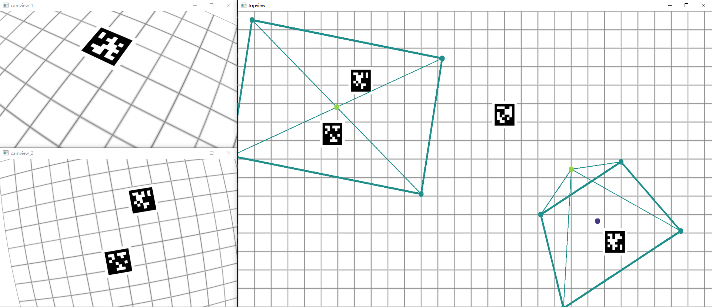
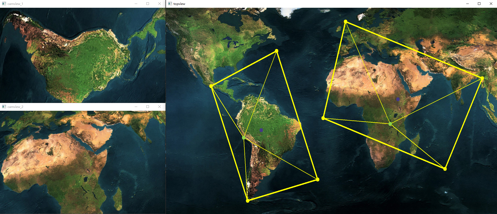

# MultiCam-Simulation &middot; [](https://github.com/your/your-project/blob/master/LICENSE)

* simulate the imaging process for multiple cameras in 3D space
* adjust internal and external coefficients freely
* simulate lens distortion in real time
* support keyboard and Xbox controller
* add AprilTag for additional experiments

## Dependencies

This project is written in Python and relies on `OpenCV`, `numpy`.

The `pupil_apriltags` library is used for the detection of AprilTag, and the `pygame` library is used for compatibility with Xbox controllers. Both of these are optional if you don't need the relevant function.

## Quick Start

Follow the commands below to install and start the simulation.

```shell
git clone https://github.com/sszxc/MultiCam-Simulation.git
cd MultiCam-Simulation/
python -m pip install -r requirements.txt
python main.py
```

Now use your keyboard or Xbox controller to control the cameras and images from each camera will be displayed in real time.

|   |XY axis|Z axis|Optical-axis|Reset|Switch Cameras|Exit|
|---|---|---|---|---|---|---|
|Keyboard|WASD|ZX|UJ IK OL|1|2, 3|Q|
|XBox Controller|L-Thumbstick|D-Pad|R-Thumbstick, LT, RT|B|L, R|A|

## Screenshots



